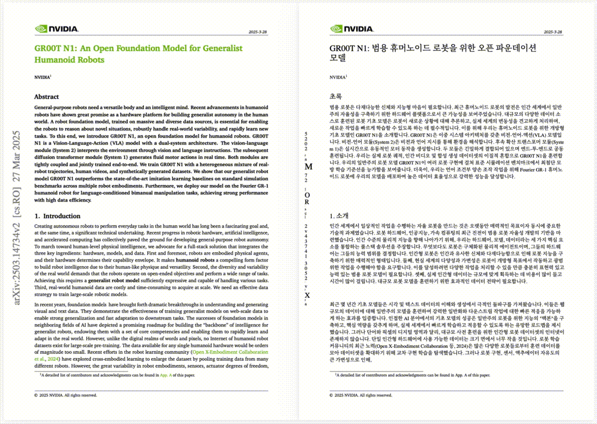
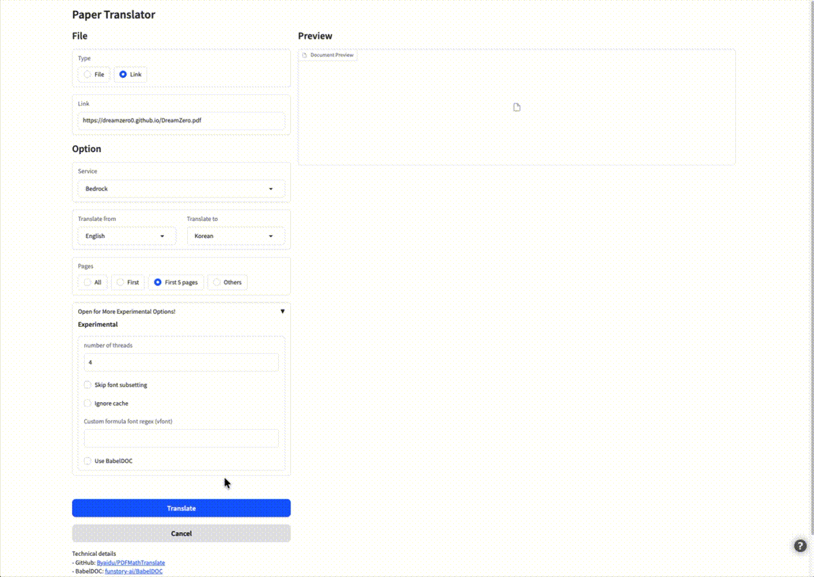

<div align="center">

<h2 id="title">Scholar Translator</h2>

**English** | [한국어](README_ko.md)

</div>

<h2 id="updates">1. What does this do?</h2>

Academic paper PDF translation tool with **Korean language focus**, powered by AWS Bedrock.

- 📊 Preserve formulas, charts, table of contents, and annotations
- 🇰🇷 **Optimized for Korean translation** with proper typography and fonts
- 🤖 **AWS Bedrock integration** with Claude Haiku 4.5 as default
- 🌐 Support [multiple languages](#usage) and translation services
- 🛠️ Provides [CLI tool](#usage), [GUI](#install), [Python API](#api), and [MCP Server](#mcp-server)
- 🐳 [Docker support](#docker) for easy deployment

<div align="center">

</div>

**Quick Start:**

```bash
# Install uv (if not already installed)
curl -LsSf https://astral.sh/uv/install.sh | sh

# Clone and setup
git clone https://github.com/hi-space/scholar-translator.git
cd scholar-translator
uv sync

# Set up AWS credentials
export AWS_ACCESS_KEY_ID="your-key"
export AWS_SECRET_ACCESS_KEY="your-secret"

# Translate your paper
uv run scholar-translator your-paper.pdf
```

<h2 id="use-section">2. Installation & Usage</h2>

### 3.1 Prerequisites

- **Python**: 3.10 - 3.12 (3.13 not yet fully supported)
- **AWS Account**: Required for default Bedrock service
  - AWS Access Key ID and Secret Access Key
  - Bedrock API access enabled in your region
  - Or use Google Translate as fallback (no API key needed)

<h3 id="install">3.2 Installation</h3>

<details open>
  <summary>3.2.1 Install with uv (Recommended - Fast & Reliable)</summary>

1. **Install uv (if not already installed):**

   ```bash
   curl -LsSf https://astral.sh/uv/install.sh | sh
   ```

2. **Clone and setup:**

   ```bash
   git clone https://github.com/your-repo/scholar-translator.git
   cd scholar-translator
   uv sync
   ```

3. **Set up AWS credentials:**

   ```bash
   export AWS_ACCESS_KEY_ID="your-access-key"
   export AWS_SECRET_ACCESS_KEY="your-secret-key"
   export AWS_REGION="us-west-2"
   ```

   Or configure via `~/.aws/credentials` file.

4. **Translate a PDF:**

   ```bash
   # Default: English → Korean using AWS Bedrock Claude Haiku 4.5
   uv run scholar-translator document.pdf

   # Specify languages
   uv run scholar-translator document.pdf -li en -lo ko

   # Use Google Translate (no AWS required)
   uv run scholar-translator document.pdf -s google
   ```

</details>

<details open>
  <summary>3.2.2 Graphical User Interface (GUI)</summary>

1. **Install and launch GUI:**

   ```bash
   # After installing with uv (see 3.2.1)
   uv run scholar-translator -i

   # Or with pip installation
   scholar-translator -i
   ```

2. **Open in browser:**

   ```
   http://localhost:7860/
   ```

3. **Features:**
   - Upload PDF files via web interface
   - Select source and target languages
   - Choose translation service (Bedrock or Google)
   - Download translated PDFs (mono and dual versions)

   

</details>

<details open>
  <summary>3.2.3 Docker Deployment</summary>

1. **Build and run:**

   ```bash
   docker compose up
   ```

   Or manually:

   ```bash
   docker build -t scholar-translator .
   docker run -d -p 7860:7860 \
     -e AWS_ACCESS_KEY_ID="your-key" \
     -e AWS_SECRET_ACCESS_KEY="your-secret" \
     -e AWS_REGION="us-west-2" \
     scholar-translator
   ```

2. **Access GUI:**

   ```
   http://localhost:7860/
   ```

For cloud deployment:

Use standard Docker deployment methods or container orchestration platforms like Kubernetes.
</details>

<details open>
  <summary>3.2.4 MCP Server (Model Context Protocol)</summary>

**Scholar Parser** includes an MCP server for integration with AI assistants like Claude Desktop and Claude Code.

### Prerequisites

Before using the MCP server, you must install the package:

**Option A: Global Installation (Recommended for End Users)**
```bash
# Install with pip
pip install scholar-translator

# Or install with uv
uv tool install scholar-translator

# Or install with pipx (isolated environment)
pipx install scholar-translator
```

**Option B: Development Installation (For Contributors)**
```bash
# Clone and install in editable mode
git clone https://github.com/your-repo/scholar-translator.git
cd scholar-translator
pip install -e .

# Or with uv
uv sync
```

### 1. Start MCP Server Directly

**STDIO mode:**
```bash
scholar-translator --mcp
```

**SSE mode:**
```bash
scholar-translator --mcp --sse --host 127.0.0.1 --port 3001
```

### 2. Available MCP Tools

- `translate_pdf`: Translate PDF files with various options
- `analyze_pdf`: Analyze PDF structure without translation
- `configure_service`: Update translator service configuration

### 3. Available MCP Resources

- `config://services`: List available translation services
- `config://models/{service}`: List models for a service
- `config://languages`: List supported language codes

### 4. Claude Desktop Integration

Add to your `claude_desktop_config.json`:

```json
{
  "mcpServers": {
    "scholar-translator": {
      "command": "scholar-translator",
      "args": ["--mcp"]
    }
  }
}
```

**Note:** This assumes you've installed the package globally using one of the methods above.

### Troubleshooting

**"scholar-translator: command not found"**

The package is not installed or not in your PATH. Run one of the installation commands from Prerequisites.

**"AWS Credentials Not Found"**

Set your AWS credentials as environment variables or in `~/.aws/credentials`:
```bash
export AWS_ACCESS_KEY_ID="your-access-key"
export AWS_SECRET_ACCESS_KEY="your-secret-key"
export AWS_REGION="us-west-2"
```

</details>

<details>
  <summary>3.2.5 Troubleshooting</summary>

**Dependency Resolution Issues:**

If you encounter dependency conflicts with pip:

```bash
# Use uv instead (recommended)
uv sync

# Or use specific Python version with pip
python3.12 -m pip install -e .
```

**Model Download Issues:**

If you encounter network difficulties downloading the DocLayout-YOLO model:

```bash
# Use HuggingFace mirror
export HF_ENDPOINT=https://hf-mirror.com
uv run scholar-translator document.pdf
```

**AWS Bedrock Issues:**

If Bedrock fails, use Google Translate as fallback:

```bash
uv run scholar-translator document.pdf -s google
```

**Python Version Issues:**

Ensure you're using Python 3.10-3.12 (3.13 not yet fully supported):

```bash
python --version

# With uv (automatically manages Python version)
uv python install 3.12
uv python pin 3.12
```

</details>

<details>
  <summary>3.2.6 Alternative: pip Installation</summary>

If you cannot use `uv`, you can install with `pip`:

**From PyPI (when published):**
```bash
pip install scholar-translator
```

**From source:**
```bash
git clone https://github.com/hi-space/scholar-translator.git
cd scholar-translator
python3.12 -m pip install -e .
```

**Note:** `uv` is the recommended installation method for better dependency management and faster performance.

</details>


<h2 id="usage">4. Usage Guide</h2>

### 4.1 Basic Usage

Execute translation to generate a language-specific subfolder with two PDF files:

```bash
scholar-translator document.pdf -lo ko
```

**Output structure:**
```
./document-ko/
  ├── document-ko-mono.pdf  # Translated only
  └── document-ko-dual.pdf  # Bilingual (original + translation)
```

- `{filename}-{lang}-mono.pdf`: Translated text only (default: Korean)
- `{filename}-{lang}-dual.pdf`: Bilingual (original + translated text)
- Output subfolder: `{filename}-{lang}/` (e.g., `document-ko/` for Korean translation)

**Multiple language translations:**
```bash
scholar-translator document.pdf -lo ko  # Creates document-ko/ subfolder
scholar-translator document.pdf -lo ja  # Creates document-ja/ subfolder
```

**Output structure with multiple languages:**
```
./document-ko/
  ├── document-ko-mono.pdf
  └── document-ko-dual.pdf
./document-ja/
  ├── document-ja-mono.pdf
  └── document-ja-dual.pdf
```

**Default behavior:**
- Source language: Auto-detect
- Target language: Korean
- Translation service: AWS Bedrock (Claude Haiku 4.5)
- Output: Language-specific subfolders created automatically

### 4.2 Command Line Options

| Option                | Function                          | Example                                           |
| --------------------- | --------------------------------- | ------------------------------------------------- |
| `files`               | Local PDF file(s)                 | `scholar-translator document.pdf`                   |
| `-i`                  | Launch GUI                        | `scholar-translator -i`                             |
| `-li`                 | Source language (default: auto)   | `scholar-translator doc.pdf -li en`                 |
| `-lo`                 | Target language (default: ko)     | `scholar-translator doc.pdf -lo ja`                 |
| `-s`                  | Translation service               | `scholar-translator doc.pdf -s google`              |
| `-m`                  | Model name/shortcut               | `scholar-translator doc.pdf -m haiku`               |
| `-t`                  | Number of threads (default: 4)    | `scholar-translator doc.pdf -t 8`                   |
| `-o`                  | Output directory                  | `scholar-translator doc.pdf -o output/`             |
| `-p`                  | Page range                        | `scholar-translator doc.pdf -p 1-5`                 |
| `-f`                  | Font regex for formula detection  | `scholar-translator doc.pdf -f "(MS.*)"`            |
| `-c`                  | Char regex for formula detection  | `scholar-translator doc.pdf -c "[0-9]"`             |
| `--ignore-cache`      | Disable translation cache         | `scholar-translator doc.pdf --ignore-cache`         |
| `--skip-subset-fonts` | Skip font subsetting              | `scholar-translator doc.pdf --skip-subset-fonts`    |
| `--config`            | Load config file                  | `scholar-translator --config config.json`           |
| `--mcp`               | Start MCP server (STDIO)          | `scholar-translator --mcp`                          |
| `--mcp --sse`         | Start MCP server (SSE)            | `scholar-translator --mcp --sse --port 3001`        |

### 4.3 Translation Services

| Service   | Description                          | Required Environment Variables                    |
| --------- | ------------------------------------ | ------------------------------------------------- |
| `bedrock` | AWS Bedrock (Claude 4.5) - Default   | `AWS_ACCESS_KEY_ID`, `AWS_SECRET_ACCESS_KEY`      |
| `google`  | Google Translate - Free              | None                                              |

### 4.4 Supported Languages

| Language            | Code    |
| ------------------- | ------- |
| Korean              | `ko`    |
| English             | `en`    |
| Japanese            | `ja`    |
| French              | `fr`    |
| German              | `de`    |
| Spanish             | `es`    |
| Russian             | `ru`    |
| Italian             | `it`    |

### 4.5 Python API

Use **Scholar Translator** in your Python applications:

**Installation:**
```bash
# Recommended: with uv
uv sync

# Alternative: from PyPI (when published)
pip install scholar-translator
```

```python
from scholar_translator import translate, translate_stream

# Translate files
params = {
    'lang_in': 'en',
    'lang_out': 'ko',
    'service': 'bedrock',
    'model': 'sonnet',
    'thread': 4
}

# Translate local file
# Returns paths to generated PDFs: ('example-ko/example-ko-mono.pdf', 'example-ko/example-ko-dual.pdf')
# Note: Automatically creates language-specific subfolder 'example-ko/'
(file_mono, file_dual) = translate(files=['example.pdf'], **params)[0]

# Translate from bytes
with open('example.pdf', 'rb') as f:
    (stream_mono, stream_dual) = translate_stream(stream=f.read(), **params)

    # Save outputs manually
    with open('output-mono.pdf', 'wb') as out:
        out.write(stream_mono)
    with open('output-dual.pdf', 'wb') as out:
        out.write(stream_dual)
```

**Output structure:**
- The `translate()` function automatically creates a language-specific subfolder: `{filename}-{lang_out}/`
- Output files include language code: `{filename}-{lang_out}-mono.pdf` and `{filename}-{lang_out}-dual.pdf`
- The `translate_stream()` function returns bytes that you can save anywhere


### 4.6 Model Context Protocol (MCP) Integration

**Scholar Translator** can be used as an MCP server with AI assistants.

**Installation:**
```bash
# Recommended: with uv
uv sync

# Alternative: from PyPI (when published)
pip install scholar-translator
```

**Usage:**

```python
from scholar_translator.mcp_server import create_mcp_app

# Create MCP application
mcp = create_mcp_app()

# Available tools:
# - translate_pdf(file, lang_in, lang_out, service, model, thread)
# - analyze_pdf(file)
# - configure_service(service, config)

# Available resources:
# - config://services
# - config://models/{service}
# - config://languages
```

<h2 id="information">5. Project Information</h2>

### 5.1 About This Project

**Scholar Translator** is a fork of [PDFMathTranslate](https://github.com/Byaidu/PDFMathTranslate), optimized for Korean language translation with AWS Bedrock integration.

**Original Project Citation:**

The original PDFMathTranslate was accepted by [EMNLP 2025](https://aclanthology.org/2025.emnlp-demos.71/):

```bibtex
@inproceedings{ouyang-etal-2025-pdfmathtranslate,
    title = "{PDFM}ath{T}ranslate: Scientific Document Translation Preserving Layouts",
    author = "Ouyang, Rongxin and Chu, Chang and Xin, Zhikuang and Ma, Xiangyao",
    booktitle = "Proceedings of EMNLP 2025: System Demonstrations",
    year = "2025",
    url = "https://aclanthology.org/2025.emnlp-demos.71/"
}
```
### 5.2 Acknowledgements

**Scholar Translator** is built on top of excellent open-source projects:

#### Core Technologies
- **[PDFMathTranslate](https://github.com/Byaidu/PDFMathTranslate)**: Original project foundation
- **[AWS Bedrock](https://aws.amazon.com/bedrock/)**: Claude 4.5 Sonnet translation engine
- **[PyMuPDF](https://github.com/pymupdf/PyMuPDF)**: PDF document manipulation
- **[Pdfminer.six](https://github.com/pdfminer/pdfminer.six)**: PDF parsing and text extraction

#### AI & Layout Detection
- **[DocLayout-YOLO](https://github.com/opendatalab/DocLayout-YOLO)**: Document layout detection
- **[Anthropic Claude](https://www.anthropic.com/)**: State-of-the-art language models

#### UI & Infrastructure
- **[Gradio](https://gradio.app/)**: Web interface framework
- **[FastMCP](https://github.com/jlowin/fastmcp)**: Model Context Protocol implementation
- **[Go Noto Universal](https://github.com/satbyy/go-noto-universal)**: Multilingual font support

### 5.3 License

This project is licensed under the **AGPL-3.0 License** - see the [LICENSE](LICENSE) file for details.

### 5.4 Related Projects

- **[PDFMathTranslate](https://github.com/Byaidu/PDFMathTranslate)**: Original Chinese-focused version
- **[PDFMathTranslate-next](https://github.com/PDFMathTranslate/PDFMathTranslate-next)**: Enhanced fork with improved compatibility
